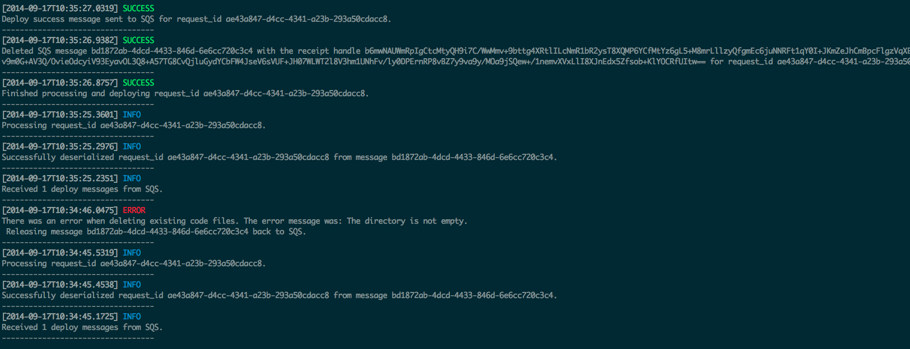

nodesdb
=======

A nodejs app to query SimpleDB domains.

## Installation
All you need to do is clone this repo and then run:

```
npm install
```

This will install all dependencies.

## Usage
The usage for this log viewer is as follows:

```
node log.js <domain> <limit>
```

* `domain` - The SDB domain to query. Default is `connect`.
* `limit` - The number of records to return. Default is 10.

This will return all records in descending order from the `timestamp` attribute.

This app will use your AWS credentials stored in the shared credentials file, which is stored at:

* `~/.aws/credentials` (Linux/Mac)
* `%USERPROFILE%\.aws\credentials`  (Windows)

### Example Output
